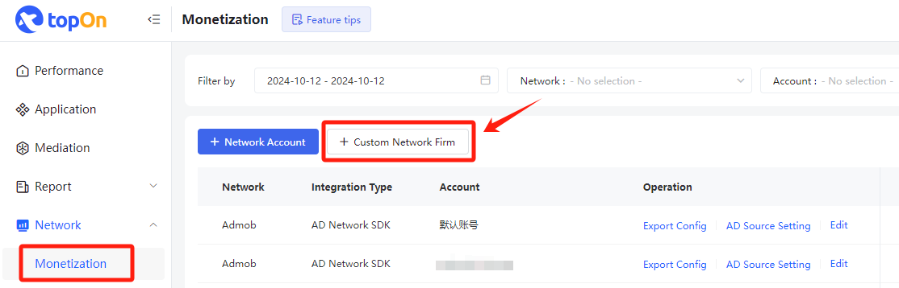
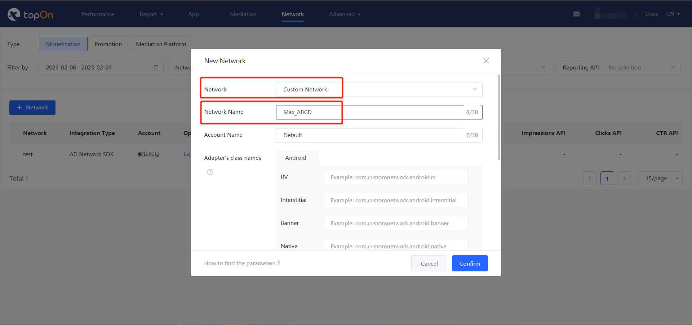
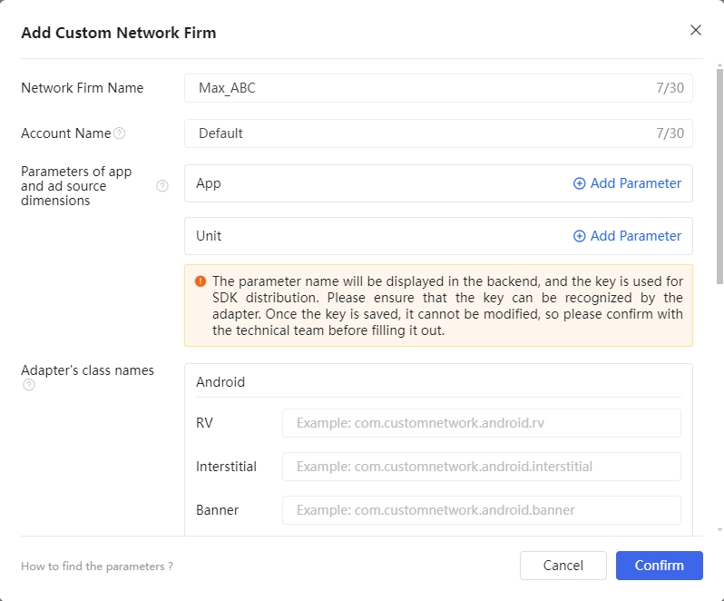
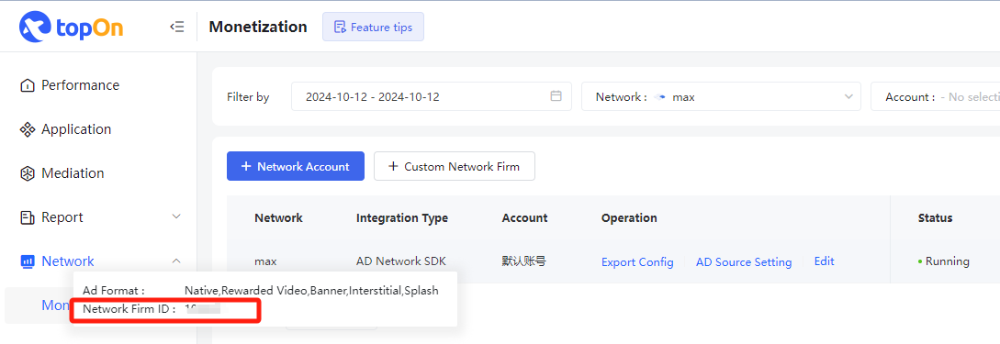

> 💡 **Tips**
> - ⚠️ Developers who comply with COPPA regulations, please ensure you are using v1.2.2 and above of the Adapter.

> Changelog
> - v1.2.6: The minimum supported MAX SDK version 13.3.0
> - v1.2.5: Only supported MAX SDK version 13.2.0
> - v1.2.3: The maximum supported MAX SDK version 13.1.0
> - v1.2.2: Supports Max v13.0.0. [The Max SDK will not be initialized for child users.](https://developers.applovin.com/en/max/android/overview/privacy/#children)
> - v1.2.1: Support Max v13.0.0
> - v1.1.7: Support Max v12.5.0

---


# Integration instructions

## Step 1. Integrate TopOn SDK

Please download the sdk from the topon background, it is recommended to integrate **TopOn v6.4.19 and above**

---

## Step 2. Introducing Max SDK&Alex Adapter

### Android

#### 1. Import Max SDK

Add the following code in build.gradle to import the platform SDK

```java
dependencies {
    api 'com.applovin:applovin-sdk:13.3.1'
}
```

#### 2. Import Alex Adapter

**⚠️ Note:** You can choose one of the following methods:

2.1 Gradle (Recommand):

Add the following code in build.gradle

```java
repositories {
    mavenCentral()
}

dependencies {
    //Alex Adapter
    api 'io.github.alex-only:max_adapter:1.2.6'
}
```

2.2 aar：

Put alex_adapter_max.aar in the libs folder of the project module (if libs does not exist, you need to create it), and then import it in build.gradle

```java
dependencies {
    implementation fileTree(dir: 'libs', include: ['*.jar','*.aar'])
}
```

2.3 code:

*Copy the code in the AlexLib/src/main/java directory to src/main/java under the project module, and modify the package name or class name of each Adapter as needed

*Add the following obfuscation rules to the proguard-rules.pro of the project (if the class name is modified, the class name of keep needs to be changed to the modified class name)

```java
-keep class com.alex.** { *;}
-keepclassmembers public class com.alex.** {
   public *;
}
```

---

### Unity

Add a file in the Assets/AnyThinkAds/Plugins/Android/NonChina/mediation directory: `Max/Editor/Dependencies.xml`

```xml
<?xml version="1.0" encoding="utf-8"?>
<dependencies>
    <androidPackages>

        <androidPackage spec="com.applovin:applovin-sdk:13.3.1"/>
        <androidPackage spec="io.github.alex-only:max_adapter:1.2.6"/>
        
    </androidPackages>
</dependencies>
```

---

## Step 3. Max integrates with other advertising platforms

<font color='red'>⚠️ If you do not need to access other advertising platforms through Max, you can skip this part.</font>


### 1. Determine the advertising platform Adapter version

Take access to Admob as an example:

1.1 Go to TopOn Background first, and check which version of Admob is compatible with the connected TopOn version? (The Admob version compatible with TopOn v6.2.72 is v22.3.0)

1.2 Then go to [Max Background](https://dash.applovin.com/documentation/mediation/android/mediation-adapters#adapter-network-information), according to the Max SDK version (v11.10.1) and Admob version (v22.3.0), find the corresponding Adapter version (that is, v22.3.0.0)

**⚠️ Note:**

(1) If you cannot find the Adapter corresponding to Admob v22.3.0, you can find the corresponding Adapter version by viewing the Changelog of the Adapter

(2) Make sure both TopOn and Max are compatible with Admob SDK


### 2. Introduce Gradle dependencies

```
dependencies {
    implementation 'com.applovin.mediation:google-adapter:22.3.0.0'
}
```

### 3. Additional configuration of the advertising platform

Enter the [Preparing Mediated Networks](https://dash.applovin.com/documentation/mediation/android/mediation-adapters#gradle) page, then check Admob and perform additional configuration according to the generated configuration instructions.

**Note**: The corresponding application ID of "com.google.android.gms.ads.APPLICATION_ID" configured in AndroidManifest.xml must be consistent with the application ID in the Admob advertising source configured in the TopOn background.


### 4. Verify integration

4.1 Call the following code to open Max’s Mediation Debugger tool

**Note：**

- Among them, sdkKey is the SDK Key of Max background.
- After testing, you need to delete this code

```java
public class MainActivity extends Activity
{
    protected void onCreate(Bundle savedInstanceState)
    {
        AppLovinSdk appLovinSdk = AppLovinSdk.getInstance(sdkKey, new AppLovinSdkSettings(context), context);
      
        appLovinSdk.setMediationProvider( "max" );
        appLovinSdk.initializeSdk( context, new AppLovinSdk.SdkInitializationListener() {
            @Override
            public void onSdkInitialized(final AppLovinSdkConfiguration configuration)
            {
                // AppLovin SDK is initialized, open mediation debugger
                appLovinSdk.showMediationDebugger();
            }
        } );
    }
}
```

4.2 Enter the [Mediation-Debugger](https://dash.applovin.com/documentation/mediation/android/testing-networks/mediation-debugger) page and follow the steps below to verify whether the advertising platform integration is normal.


---

## Step 4. TopOn background configuration

1、After connecting according to the SDK docking document, you need to add a custom advertising platform in the background



2、Select [Custom Network], fill in the advertising platform name and account name, and fill in the Adapter according to the SDK docking document

*The name of the advertising platform needs to be written with Max, which is convenient for distinguishing the advertising platform. The suggested name format: Max_XXXXX

**Note**: Just fill in the above two information, there is no need to fill in the parameters of app and ad source dimensions.



**Note**: If you use the gradle、aar method or directly use the source code method (without modifying the class name), please configure the following class name. If the class name is modified, please configure the modified class name

```
com.alex.AlexMaxRewardedVideoAdapter
com.alex.AlexMaxInterstitialAdapter
com.alex.AlexMaxBannerAdapter
com.alex.AlexMaxNativeAdapter
com.alex.AlexMaxSplashAdapter
```



3、Record Network Firm ID



After the above configurations are completed, you can add ad sources in TopOn.

<br>

#### The Key used in the Adapter

```
"sdk_key": SDK Key of advertising platform
"unit_id": Advertising slot ID of the advertising platform
"unit_type": Ad slot type, 0: Banner, 1: MREC
```

The JSON configuration example when adding an ad source in the background is as follows: (xxx needs to be replaced with the actual SDK key and ad slot ID of Max, and "unit_type" does not need to be configured for non-banner ad slots)

```
{
    "sdk_key":"xxx",
    "unit_id":"xxx",
    "unit_type":"0"
}
```

---

## Step 5. Max setting

### 1. Create Max account

Log in to the [MAX](https://dash.applovin.com/o/mediation) official website to apply for an account


### 2. Create MAX app and ad unit

Create app and ad unit in MAX-->Manage-->Ad Units


### 3. Complete Network information configuration in MAX


### 4. MAX Advertisement Description

The corresponding relationship between MAX’s Unit and TopOn’s placement type is as follows:

| MAX-Unit               | TopOn-placement          |
| ---------------------- | ------------------------ |
| Banner                 | Banner                   |
| Interstitial           | Interstitial             |
| Rewarded               | Rewarded Video           |
| App Open               | Splash                   |
| Native (Manual)        | Native - self render     |
| Native (Small、Medium) | Native - template render |


### 5. Configure MAX unit

#### 5.1 Configure the unit of MAX

5.1.1 Obtain the Ad Unit ID of MAX through the following path: MAX-->Manage-->Ad Units


5.1.2. Configure MAX parameters in the TopOn

1) Add an ad source, log in to the TopOn → Mediation → Add ad source

---

## Step 6. Test Max ads

<font color='red'>⚠️ Please make sure you have followed the instructions above to create applications and advertising placement in the Max backend and configure them under the advertising placement in the TopOn backend.</font>


### 1. Open the log of TopOn SDK

```java
ATSDK.setNetworkLogDebug(true);//The SDK log function is recommended to be turned on during the integration testing phase and must be turned off before going online.
```

> After opening, you can filter this TAG in Logcat to view related logs: `anythink|AppLovinSdk`

(1) The device ID (GAID) can be obtained through the following logs

```java
anythink: ********************************** UA_6.x.xx *************************************
anythink: GAID(ADID): ********-****-****-****-************ , AndroidID: ****************
anythink: ********************************** UA_6.x.xx *************************************
```

### 2. Open Max's test mode

Enter the [MAX - Test Mode](https://dash.applovin.com/o/mediation/test_modes) page, click the `Add Test Device` button, and fill in the GAID obtained above in the input box of IDFA (iOS) or GAID (Android), then select the advertising platform that needs to be tested, and click `Save` to save it.


> For more information, please refer to [MAX Test Mode](https://dash.applovin.com/documentation/mediation/android/testing-networks/test-mode)


### 3. Load & display ads

After adding the test device to the Max backend, please wait for 5 to 10 minutes. After the configuration takes effect, call the relevant methods of the TopOn SDK to load and display the TopOn placement to verify whether the integration of the Max advertising is normal.
