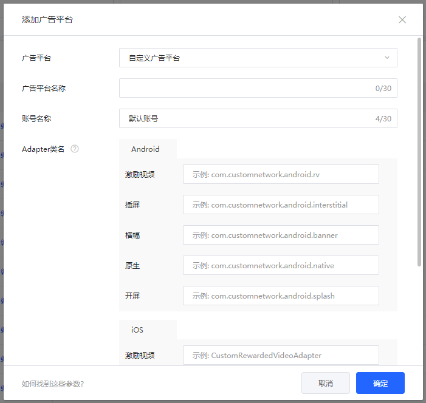

# 集成

## 一. 接入TopOn SDK

请参考[TopOn SDK集成文档](https://docs.toponad.com/#/zh-cn/android/android_doc/android_sdk_config_access)接入TopOn SDK，建议接入**TopOn v6.1.65及以上版本**


## 二. 引入Alex Adapter

1. 将AlexLib/src/main/java目录下的代码复制拷贝到项目module下的src/main/java中，可根据需要修改各个Adapter的包名或者类名

2. 将以下混淆规则添加到项目中的proguard-rules.pro中（如果有修改类名，keep的类名需改为修改后的类名）

   ```
   -keep class com.alex.** { *;}
   -keepclassmembers public class com.alex.** {
      public *;
   }
   ```

   

### 三. 配置自定义广告平台

在TopOn后台的广告平台页面，点击添加自定义广告平台，并将复制到项目中的各个Adapter的类名配置进页面中。

比如：将激励视频的Adapter（com.alex.AlexMaxRewardedVideoAdapter）配置到下方激励视频对应的文本框中（如果有修改类名，需配置修改后的类名）。

**注意：**配置的Adapter必须是包名加类名的形式


