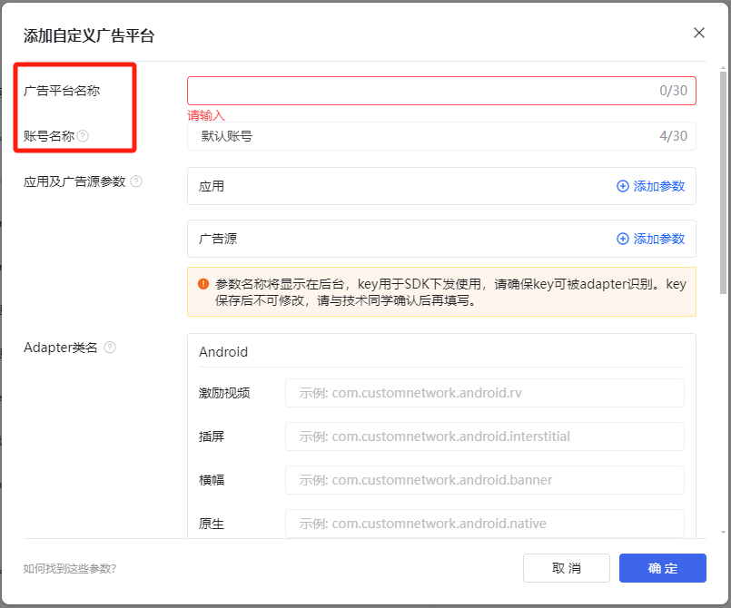
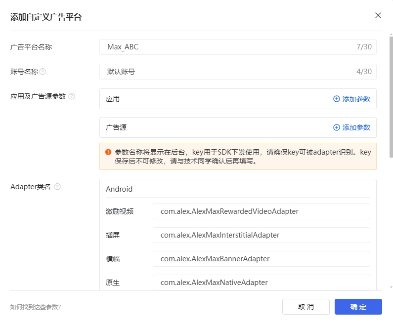

**v1.1.7版本更新说明:**

支持Max v12.5.0


**v1.1.3版本更新说明:**

1.支持Max的自渲染广告接入，目前能适配Applovin，Admob（com.applovin.mediation:google-adapter版本必须是v22.1.0.1以上）的接入

2.自渲染广告必须将相关的View设置进入ATNativePrepareInfo里面，以下是必须设置的：

| API                                  | 说明              |
| ------------------------------------ | ----------------- |
| setTitleView(View titleView)         | 绑定标题View      |
| setIconView(View iconView)           | 绑定应用图标 View |
| setMainImageView(View mainImageView) | 绑定大图View      |
| setDescView(View descView)           | 绑定描述View      |
| setCtaView(View ctaView)             | 绑定CTA按钮View   |


# 集成

Tip: If necessary, please refer to [the English documentation](https://github.com/Alex-only/AlexMaxDemo_Android/blob/main/README_EN.md)

## 一. 接入TopOn SDK

请从TopOn后台下载接入SDK，建议接入**TopOn v6.3.52及以上版本**。

**注意**：在调用new ATRewardVideoAd()、new ATInterstitial()、new ATBannerView()时，**必须传入Activity**，否则Max广告将请求失败


## 二. 引入Max SDK&Alex Adapter

### Android

#### 1. 引入Max SDK

在build.gradle中添加以下代码，引入平台SDK

```java
dependencies {
    //Max SDK
    api 'com.applovin:applovin-sdk:12.5.0'
}
```

#### 2. 引入Alex Adapter

**注意**：以下方式任选其一即可

2.1 Gradle引入(推荐)：

在build.gradle中添加以下代码：

```java
repositories {
    mavenCentral()
}

dependencies {
    //Alex Adapter
    api 'io.github.alex-only:max_adapter:1.1.9'
}
```

2.2 aar：

将alex_adapter_max.aar放到项目module的libs文件夹下（如果没有libs文件夹，则需要创建），然后在build.gradle中进行引入

```java
dependencies {
    implementation fileTree(dir: 'libs', include: ['*.jar','*.aar'])
}
```

2.3 源码：

*将AlexLib/src/main/java目录下的代码复制拷贝到项目module下的src/main/java中，可根据需要修改各个Adapter的包名或者类名。

*在项目的proguard-rules.pro中添加以下混淆规则（如果有修改类名，keep的类名需改为修改后的类名）

```java
-keep class com.alex.** { *;}
-keepclassmembers public class com.alex.** {
   public *;
}
```


### Unity

在 Assets/AnyThinkAds/Plugins/Android/NonChina/mediation目录下添加文件：`Max/Editor/Dependencies.xml`

```xml
<?xml version="1.0" encoding="utf-8"?>
<dependencies>
    <androidPackages>

        <androidPackage spec="com.applovin:applovin-sdk:12.5.0"/>
        <androidPackage spec="io.github.alex-only:max_adapter:1.1.9"/>
        
    </androidPackages>
</dependencies>
```


## 三. Max接入其他广告平台

<font color='red'>如果不需要通过Max接入其他广告平台，可跳过此部分内容。</font>


### 1. 确定广告平台Adapter版本

以接入Admob为例：

1.1 先到TopOn后台，查看接入的TopOn版本兼容的Admob版本是多少？（TopOn v6.2.72版本兼容的Admob版本为v22.3.0）

1.2 然后到 [Max后台](https://dash.applovin.com/documentation/mediation/android/mediation-adapters#adapter-network-information)，根据接入的Max SDK版本（v11.10.1）和Admob版本（v22.3.0），查找对应的Adapter版本（即v22.3.0.0）

**注意：**

（1）如果找不到Admob v22.3.0版本对应的Adapter，可通过查看Adapter的Changelog，找到对应的Adapter版本

（2）需确保TopOn和Max都兼容Admob SDK


### 2. 引入广告平台Adapter

```java
dependencies {
    implementation 'com.applovin.mediation:google-adapter:22.3.0.0'
}
```

### 3. 广告平台的额外配置

进入[Preparing Mediated Networks](https://dash.applovin.com/documentation/mediation/android/mediation-adapters#gradle)页面，然后勾选Admob，根据生成的配置说明，进行额外配置

**注意**：配置在AndroidManifest.xml中的"com.google.android.gms.ads.APPLICATION_ID"，其对应的应用ID，必须与TopOn后台配置的Admob广告源中的应用ID一致


### 4. 验证集成

4.1 调用以下代码，开启Max的Mediation Debugger工具

**注意：**

- 其中sdkKey为Max后台的SDK Key
- 测试完毕后，需删除此代码

```java
public class MainActivity extends Activity
{
    protected void onCreate(Bundle savedInstanceState)
    {
        AppLovinSdk appLovinSdk = AppLovinSdk.getInstance(sdkKey, new AppLovinSdkSettings(context), context);
      
        appLovinSdk.setMediationProvider( "max" );
        appLovinSdk.initializeSdk( context, new AppLovinSdk.SdkInitializationListener() {
            @Override
            public void onSdkInitialized(final AppLovinSdkConfiguration configuration)
            {
                // AppLovin SDK is initialized, open mediation debugger
                appLovinSdk.showMediationDebugger();
            }
        } );
    }
}
```

4.2 进入[Mediation-Debugger](https://dash.applovin.com/documentation/mediation/android/testing-networks/mediation-debugger)页面，按照以下步骤，验证广告平台集成是否正常


## 四. TopOn后台配置

1、按照SDK对接文档接入同时，需要在后台添加自定义广告平台


2、选择【自定义广告平台】，填写广告平台名称、账号名称，按照SDK的对接文档填写Adapter

*广告平台名称需要写上Max，便于区分广告平台，建议名称格式：Max_XXXXX

**注意**：只填写上述两个信息即可，不需要填写应用及广告源参数



**注意**：如果是使用gradle、aar方式或者直接使用源码方式（没有修改类名），请配置以下类名。如果修改了类名，请配置修改后的类名

```
激励视频：com.alex.AlexMaxRewardedVideoAdapter
插屏：com.alex.AlexMaxInterstitialAdapter
横幅：com.alex.AlexMaxBannerAdapter
原生：com.alex.AlexMaxNativeAdapter
开屏：com.alex.AlexMaxSplashAdapter
```



3、记录广告平台ID


以上配置都完成之后，可以添加广告源配置


#### Adapter中使用的Key说明

```
"sdk_key": 广告平台的SDK Key
"unit_id": 广告平台的广告位ID
"unit_type": 广告位类型，0: Banner, 1: MREC
```

后台添加广告源时的JSON配置示例如下：（xxx需要替换为Max实际的SDK key以及广告位ID，非横幅广告位不需要配置"unit_type"）

```json
{
    "sdk_key":"xxx",
    "unit_id":"xxx",
    "unit_type":"0"
}
```


## 五. Max后台配置

### Step1.创建MAX帐号

登录[MAX官网](https://dash.applovin.com/o/mediation)申请开通账号


### Step2.创建MAX的应用和广告单元

在MAX-->Manage-->Ad Units中创建应用和广告位


### Step3.在MAX完成Network信息配置


### Step4. MAX广告位说明

MAX的Unit跟TopOn的广告类型对应关系如下：

| MAX-Unit                | TopOn-广告类型              |
| ----------------------- | --------------------------- |
| Banner                  | 横幅广告 Banner             |
| Interstitial            | 插屏广告 Interstitial       |
| Rewarded                | 激励视频广告 Rewarded Video |
| App Open                | 开屏广告 Splash             |
| Native（Manual）        | 原生广告 - 自渲染 Native    |
| Native（Small、Medium） | 原生广告 - 模板渲染 Native  |


### Step5. 在后台配置MAX广告位

#### 5.1 配置MAX 的广告源

5.1.1 通过以下路径获取MAX 的Ad Unit ID：MAX-->Manage-->Ad Units


5.1.2. 将MAX的参数配置在TopOn后台

添加广告源，登录TopOn后台→广告平台→变现平台→广告源管理（Max）→添加广告源


## 六、测试Max广告

<font color='red'>请确保已经按照上方说明，已经在Max后台创建好应用和广告位，并将其配置到TopOn后台的广告位下</font>


### 1. 打开TopOn SDK的日志

```java
ATSDK.setNetworkLogDebug(true);//SDK日志功能，集成测试阶段建议开启，上线前必须关闭
```

> 打开后，可在Logcat中过滤此TAG查看相关日志：`anythink|AppLovinSdk`

（1）可通过以下日志获取设备ID(GAID)

```java
anythink: ********************************** UA_6.x.xx *************************************
anythink: GAID(ADID): ********-****-****-****-************ , AndroidID: ****************
anythink: ********************************** UA_6.x.xx *************************************
```


### 2. 打开Max的测试模式

进入[MAX - Test Mode](https://dash.applovin.com/o/mediation/test_modes)页面，点击`Add Test Device`按钮，在IDFA (iOS) or GAID (Android)的输入框中填入上面获取到的GAID，然后选择需要进行测试的广告平台，点击`Save`进行保存。


> 更多信息，请参考 [MAX Test Mode](https://dash.applovin.com/documentation/mediation/android/testing-networks/test-mode)


### 3. 加载&展示广告

在Max后台添加测试设备后，请等待5~10分钟，待配置生效后，调用TopOn SDK的相关方法进行TopOn广告位的加载&展示，验证Max广告的集成是否正常

