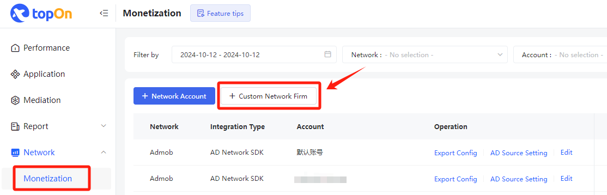
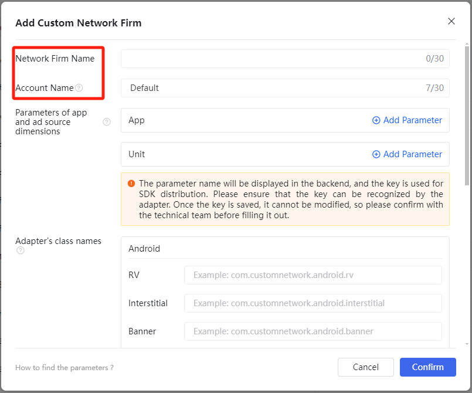
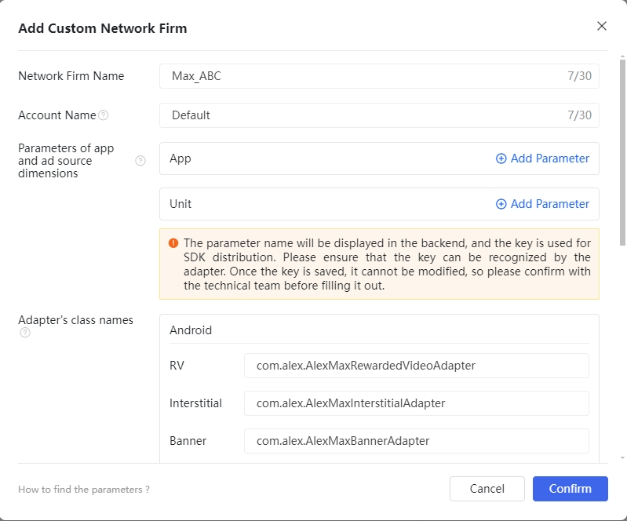

**Changle Log v1.1.3:**

1.Supports Max’s self-rendering ad, and currently compatible with Applovin, Admob.

2.Self-rendering ads must enter the relevant View settings into ATNativePrepareInfo. The following must be set:

| API                                  | **Note**                   |
| ------------------------------------ | -------------------------- |
| setTitleView(View titleView)         | Bind Title View            |
| setIconView(View iconView)           | Bind App Icon View         |
| setMainImageView(View mainImageView) | Bind the main image View   |
| setDescView(View descView)           | Bind description View      |
| setCtaView(View ctaView)             | Bind call to action button |


# Integration instructions

## Step 1. Integrate TopOn SDK

Please refer to [TopOn SDK Integration Documentation](https://docs.toponad.com/#/en-us/android/android_doc/android_sdk_config_access) to integrate TopOn SDK, it is recommended to integrate **TopOn v6.1.65 and above**


## Step 2. Introducing Max SDK&Alex Adapter

### Android

#### 1. Import Max SDK

Add the following code in build.gradle to import the platform SDK

```java
dependencies {
    api 'com.applovin:applovin-sdk:11.9.0'
}
```

#### 2. Import Alex Adapter

**Note:** You can choose one of the following methods:

2.1 Gradle (Recommand):

Add the following code in build.gradle

```java
repositories {
    mavenCentral()
}

dependencies {
    //Alex Adapter
    api 'io.github.alex-only:max_adapter:1.1.3'
}
```

2.2 aar：

Put alex_adapter_max.aar in the libs folder of the project module (if libs does not exist, you need to create it), and then import it in build.gradle

```java
dependencies {
    implementation fileTree(dir: 'libs', include: ['*.jar','*.aar'])
}
```

2.3 code: 

*Copy the code in the AlexLib/src/main/java directory to src/main/java under the project module, and modify the package name or class name of each Adapter as needed

*Add the following obfuscation rules to the proguard-rules.pro of the project (if the class name is modified, the class name of keep needs to be changed to the modified class name)

```java
-keep class com.alex.** { *;}
-keepclassmembers public class com.alex.** {
   public *;
}
```


### Unity

Add a file in the Assets/AnyThinkAds/Plugins/Android/NonChina/mediation directory: `Max/Editor/Dependencies.xml`

```xml
<?xml version="1.0" encoding="utf-8"?>
<dependencies>
    <androidPackages>

        <androidPackage spec="com.applovin:applovin-sdk:11.9.0"/>
        <androidPackage spec="io.github.alex-only:max_adapter:1.1.3"/>
        
    </androidPackages>
</dependencies>
```


### 3. The Key used in the Adapter

```
"sdk_key": SDK Key of advertising platform
"unit_id": Advertising slot ID of the advertising platform
"unit_type": Ad slot type, 0: Banner, 1: MREC
```

The JSON configuration example when adding an ad source in the background is as follows: (xxx needs to be replaced with the actual SDK key and ad slot ID of Max, and "unit_type" does not need to be configured for non-banner ad slots)

```
{
    "sdk_key":"xxx",
    "unit_id":"xxx",
    "unit_type":"0"
}
```


## Step 3. Max integrates with other advertising platforms

If you do not need to access other advertising platforms through Max, you can skip this part. Take access to Mintegral as an example:

1、Go to [TopOn Backstage](https://docs.toponad.com/#/en-us/android/download/package) first, and check which version of Mintegral is compatible with the connected TopOn version? (The Mintegral version compatible with TopOn v6.1.65 is v16.3.61)

2、Then go to [Max Background](https://dash.applovin.com/documentation/mediation/android/mediation-adapters#adapter-network-information), according to the Max SDK version (v11.6.0) and Mintegral version ( v16.3.61), find the corresponding Adapter version (that is, v16.3.61.0)

**Note:**

(1) If you cannot find the Adapter corresponding to Mintegral v16.3.61, you can find the corresponding Adapter version by viewing the Changelog of the Adapter

(2) Make sure both TopOn and Max are compatible with Mintegral SDK


3、Introduce Gradle dependencies:

```
dependencies {
    implementation 'com.applovin.mediation:mintegral-adapter:16.3.61.0'
}
```


## Step 4. TopOn background configuration

1、After connecting according to the SDK docking document, you need to add a custom advertising platform in the background



2、Select [Custom Network], fill in the advertising platform name and account name, and fill in the Adapter according to the SDK docking document

*The name of the advertising platform needs to be written with Max, which is convenient for distinguishing the advertising platform. The suggested name format: Max_XXXXX



**Note**: If you use the gradle、aar method or directly use the source code method (without modifying the class name), please configure the following class name. If the class name is modified, please configure the modified class name

```
com.alex.AlexMaxRewardedVideoAdapter
com.alex.AlexMaxInterstitialAdapter
com.alex.AlexMaxBannerAdapter
com.alex.AlexMaxNativeAdapter
com.alex.AlexMaxSplashAdapter
```



3、Record Network Firm ID


After the above configurations are completed, you can add ad sources in TopOn.


## Step 5. Max setting

### 1. Create Max account

Log in to the [MAX](https://dash.applovin.com/o/mediation) official website to apply for an account


### 2. Create MAX app and ad unit

Create app and ad unit in MAX-->Manage-->Ad Units


### 3. Complete Network information configuration in MAX 


### 4. MAX Advertisement Description

The corresponding relationship between MAX’s Unit and TopOn’s placement type is as follows:

| MAX-Unit     | TopOn-placement |
| ------------ | --------------- |
| Banner       | Banner          |
| Interstitial | Interstitial    |
| Rewarded     | Rewarded Video  |
| App Open     | Splash          |
| Native       | Native          |


### 5. Configure MAX unit

#### 5.1 Configure the unit of MAX

5.1.1 Obtain the Ad Unit ID of MAX through the following path: MAX-->Manage-->Ad Units


5.1.2. Configure MAX parameters in the TopOn

1) Add an ad source, log in to the TopOn → Mediation → Add ad source

