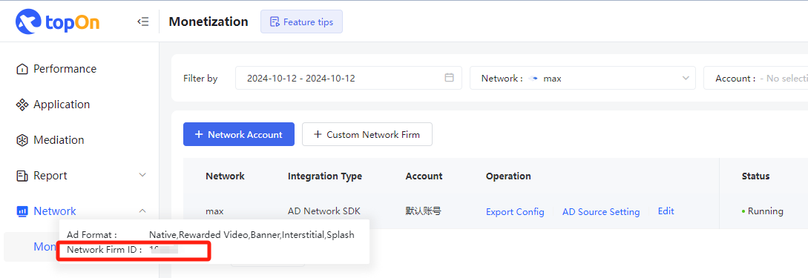
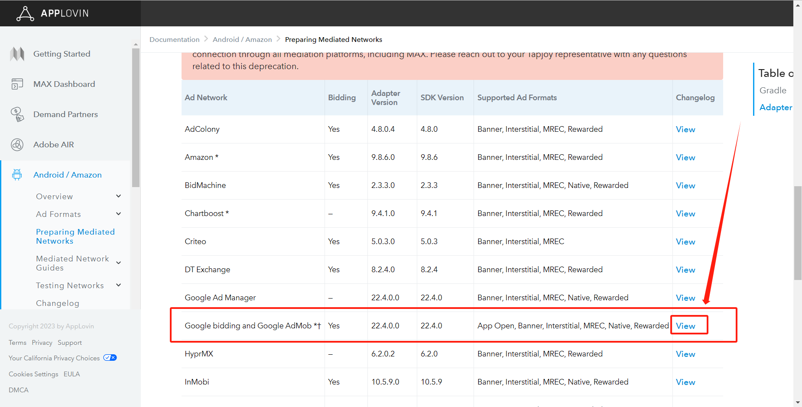

# Integration instructions

## Step 1. Integrate TopOn SDK

Please refer to [TopOn SDK Integration Documentation](https://docs.toponad.com/#/en-us/android/android_doc/android_sdk_config_access) to integrate TopOn SDK, it is recommended to integrate **TopOn v6.1.65 and above**


## Step 2. Introducing Alex Adapter

1、Add the following code in build.gradle to import the platform SDK

```java
dependencies {
    api 'com.applovin:applovin-sdk:11.6.0'
}
```

2、Copy the code in the AlexLib/src/main/java directory to src/main/java under the project module, and modify the package name or class name of each Adapter as needed

3、Add the following obfuscation rules to the proguard-rules.pro of the project (if the class name is modified, the class name of keep needs to be changed to the modified class name)

```java
-keep class com.alex.** { *;}
-keepclassmembers public class com.alex.** {
   public *;
}
```

4、The Key used in the Adapter is described as follows:

```
"sdk_key": SDK Key of advertising platform
"unit_id": Advertising slot ID of the advertising platform
"unit_type": Ad slot type, 0: Banner, 1: MREC
```

The JSON configuration example when adding an ad source in the background is as follows: (xxx needs to be replaced with the actual SDK key and ad slot ID of Max, and "unit_type" does not need to be configured for non-banner ad slots)

```
{
    "sdk_key":"xxx",
    "unit_id":"xxx",
    "unit_type":"0"
}
```


### Step 3. background configuration

1、After connecting according to the SDK docking document, you need to add a custom advertising platform in the background


2、Select [Custom Network], fill in the advertising platform name and account name, and fill in the Adapter according to the SDK docking document

*The name of the advertising platform needs to be written with Max, which is convenient for distinguishing the advertising platform. The suggested name format: Max_XXXXX


3、Record Network Firm ID



4、After the advertising platform is added, add the advertising source (you can configure it according to the corresponding style when adding the advertising source)

5、You can edit the advertising platform settings, choose whether to open the report api and pull the data


### Step 4. Max integrates with other advertising platforms

If you do not need to access other advertising platforms through Max, you can skip this part. Take access to Mintegral as an example:

1、Go to [TopOn Backstage](https://docs.toponad.com/#/en-us/android/download/package) first, and check which version of Mintegral is compatible with the connected TopOn version? (The Mintegral version compatible with TopOn v6.1.65 is v16.3.61)

2、Then go to [Max Background](https://dash.applovin.com/documentation/mediation/android/mediation-adapters#adapter-network-information), according to the Max SDK version (v11.6.0) and Mintegral version ( v16.3.61), find the corresponding Adapter version (that is, v16.3.61.0)

**Note:**

(1) If you cannot find the Adapter corresponding to Mintegral v16.3.61, you can find the corresponding Adapter version by viewing the Changelog of the Adapter

(2) Make sure both TopOn and Max are compatible with Mintegral SDK



3、Introduce Gradle dependencies:

```
dependencies {
    implementation 'com.applovin.mediation:mintegral-adapter:16.3.61.0'
}
```

